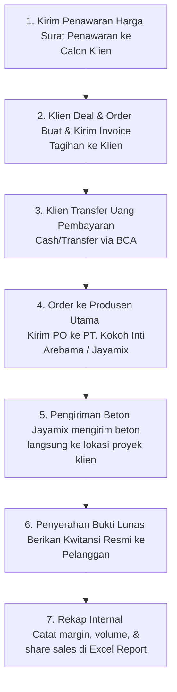

Edited extract_pdfs.py
Ran command: `C:\Users\haldies\miniconda3\python.exe C:\Users\haldies\.gemini\antigravity-ide\brain\b92e1e6f-32ed-47b5-adcc-803796d40555\scratch\extract_pdfs.py`

Berdasarkan hasil pembacaan dan analisis mendalam terhadap semua berkas PDF & Excel yang ada di dalam folder `data_client`, berikut adalah rangkuman lengkap mengenai fungsi tiap dokumen, produk yang dijual, serta alur bisnis (*business flow*) perusahaan Anda:

---

### 📂 1. Fungsi Setiap Berkas di Folder `data_client`

Folder `data_client` menyimpan **dokumen-dokumen transaksi nyata** yang merepresentasikan seluruh siklus penjualan perusahaan Anda. Berikut fungsinya masing-masing:

1.  **`20012026-PT. Harapan Mulya Bersama.pdf` (Surat Penawaran Harga)**
    *   **Fungsi:** Sebagai dokumen promosi/penawaran harga awal yang dikirimkan ke calon pelanggan (dalam hal ini PT. Harapan Mulya Bersama). Dokumen ini mencantumkan daftar harga berbagai mutu beton, besi wiremesh, jasa finishing lantai (trowel), serta syarat & ketentuan pemesanan (ketentuan slump, screening, tes lab, dan nomor rekening BCA).
2.  **`PO_PRO_INV - KOKOH - Copy.pdf` (Invoice / Tagihan)**
    *   **Fungsi:** Sebagai tagihan pembayaran yang dikirimkan kepada pembeli (dalam hal ini PT. Tri Megah Baswara) atas pemesanan beton jadi (mutu K350 NFA). Dokumen ini meminta pembeli melakukan pembayaran via transfer ke rekening BCA CV Aditara Jaya Makmur sebelum pengiriman dilakukan.
3.  **`PO 09062026001-Bpk. Bachnas.pdf` (Purchase Order / PO)**
    *   **Fungsi:** Dokumen pesanan pembelian yang dikeluarkan oleh perusahaan Anda (CV Aditara Jaya Makmur) kepada supplier/distributor utama beton (**PT. Kokoh Inti Arebama Tbk. - Jayamix**). PO ini dibuat untuk memesan beton mutu K300 sebanyak $31\text{ m}^3$ untuk dikirimkan langsung ke lokasi proyek pelanggan Anda (Bpk. Bachnas di Surakarta).
4.  **`KWITANSI-29042026-PT. SOLINDO TAMA JAYA.pdf` (Kwitansi / Tanda Terima)**
    *   **Fungsi:** Bukti resmi bahwa perusahaan Anda telah menerima uang pembayaran secara penuh (status: **Lunas**) dari pelanggan (PT. Solindo Tama Jaya) sebesar Rp 42.624.000 atas transaksi beton mutu K400 sebanyak $48\text{ m}^3$ (termasuk PPN 11%).
5.  **`REPORT APRIL 2026.xlsx` (Rekapitulasi Penjualan & Margin)**
    *   **Fungsi:** Laporan internal (pembukuan bulanan) untuk merekap seluruh pengiriman beton dari berbagai plant (Kediri, Gempol, Manukan, Malang, dll.). Laporan ini mencatat volume, harga kesepakatan klien (DEAL), harga beli ke supplier (BUY IN), bagi hasil margin, komisi sales, dan total laba bersih perusahaan.

---

### 🏗️ 2. Produk Apa yang Dijual Perusahaan Anda?

CV Aditara Jaya Makmur merupakan **Authorized Dealer of Jayamix** (Penyedia Beton Cor Ready-Mix dan Material Konstruksi). Produk utama yang dijual meliputi:
1.  **Beton Cor Ready-Mix (Beton Jadi):** Berbagai tingkat kekuatan/mutu tekan seperti **K225, K250, K300, K325, K350, K400** (termasuk opsi Screening/Batu Pecah Kecil dan NFA/Non Fly Ash).
2.  **Besi Konstruksi:** Besi Wiremesh M6 (ulir segitiga dan ulir bulat).
3.  **Jasa Konstruksi Lantai:** Pekerjaan Trowel (meliputi pemasangan plastik cor, perataan level lantai, gelar wiremesh, gelar beton, hingga penghalusan lantai menggunakan mesin trowel).

---

### 🔄 3. Alur Bisnis (*Business Flow*) Perusahaan Anda

Berdasarkan dokumen-dokumen tersebut, alur operasional bisnis perusahaan Anda berjalan sebagai berikut:

1.  **Tahap Penawaran (Quotation):** Perusahaan mengirimkan daftar harga mutu beton ke klien melalui **Surat Penawaran Harga**.
2.  **Tahap Pemesanan & Tagihan (Invoicing):** Setelah jenis dan volume beton disepakati, Anda menerbitkan **Invoice** sebagai penagihan resmi. Klien wajib membayar lunas sebelum beton dikirim.
3.  **Tahap Pembelian ke Supplier (Purchase Order):** Begitu uang masuk ke rekening BCA Anda, perusahaan Anda menerbitkan **PO** ke produsen beton utama (PT. Kokoh Inti Arebama - Jayamix) untuk menjadwalkan batching plant terdekat mengirim beton ke lokasi proyek klien.
4.  **Tahap Pelunasan (Receipt):** Anda mengirimkan **Kwitansi** bertanda tangan Favirru Bagus Mahardhika dengan stempel "Lunas" sebagai bukti bayar sah untuk klien.
5.  **Tahap Evaluasi Laba (Internal Report):** Di akhir bulan, semua transaksi dicatat dalam **Excel Report** untuk menghitung selisih harga jual (*Deal*) dan harga beli (*Buy In*) guna pembagian profit/margin bersih.